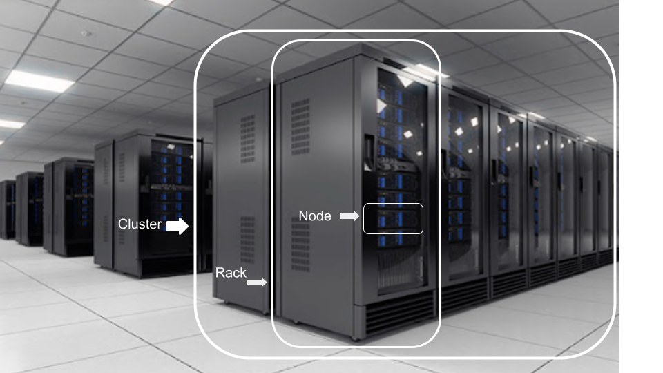

# **Predicting Severity 1 (Reboot and Crash) Incidents Using Machine Learning on Severity 2 Telemetry from Cloud DataCenter Nodes**

### Author: Pablo Rivera

## Executive Summary:

The world’s largest cloud providers continuously roll out new hardware and software technologies—ranging from the latest CPUs and GPUs to advanced networking, storage enhancements, and updated software versions—to compete on efficiency and security. These innovations are integrated into high-capacity servers known as nodes. Typically, 20 nodes are housed within a rack, and 20 racks make up a cluster. Clusters serve as the basic modular units that are deployed into data centers worldwide.

Despite rigorous pre-deployment testing, these cutting-edge nodes frequently experience operational issues. Critical failures are categorized as Severity 1 (Sev1) incidents—such as system crashes or unexpected reboots—while Severity 2 (Sev2) events indicate degraded performance or functionality. Second-by-second telemetry data on Sev1 and Sev2 events is collected from every node, in every rack, across every data center globally, providing a rich dataset for monitoring, analysis, and predictive modeling.

The purpose of this project is to develop a machine learning model capable of predicting whether a Severity 2 (Sev2) incident is likely to escalate into a Severity 1 (Sev1) incident within a specific node and time window. By leveraging detailed telemetry data collected across global data centers,

## Disclaimer:

The dataset used in this project has been anonymized to protect sensitive infrastructure and organizational information. All identifiers, including Node IDs, Cluster names, and service references, have been altered or generalized to prevent traceability to real systems or entities. This analysis is for research purposes only and does not reflect any specific real-world infrastructure.

## Rationale

Why should anyone care about this question?

The model aims to identify early warning signals, this can allocate valuable resources to execute proactive mitigation strategies instead of reacting after the issue happened. This change of approach ultimately will save resources and improve the whole system reliability by reducing downtime.

## Research Question

What are you trying to answer?

For each node in each cluster of new technology delivered into a Data Center I want to answer if the Sev2 being reported by the node could lead to a Sev1 System Crash or Reboot. I want to predict with a 70% of confidence if the node will suffer a Sev1

## Data Sources

What data will you use to answer you question?

The data comes from one of the largest Cloud Provider internal telemetry systems that feed large databases with second to second status of every node in every cluster.  Initially I have 50 clusters that were deployed recently that have a blend of new CPU, new Storage, new Networking capabilities to offer more speed to run new AI workloads.

## Methodology

What methods are you using to answer the question?

### **1. Exploratory Data Analysis (EDA)**
**Goal:** Understand the structure and quality of the telemetry data gathered from cloud infrastructure nodes

- The dataset includes timestamped incident logs from nodes across multiple clusters.
- Each log includes root cause analysis levels (RCALevel1 and RCALevel2), timestamp, NodeId, ClusterId, Team to Escalate, Service Name among many others 
- Dropped duplicated and columns with no information and correlation with the variables we were trying to predict, which is given a Sev2 if there is a high chance to escalate to Sev1
- Visual inspection showed that a subset of nodes experienced Sev1 incidents without prior Sev2s—these were excluded to focus on potential escalation patterns.
- Early pie charts and bar charts highlighted the potential for modeling escalation paths and revealed major contributors to Sev1 incidents.

### **2. Feature Engineering**

**Goal:** Construct meaningful features and structure the dataset to reflect causal relationships.

- Retained only nodes that had Sev2 incidents and either did or did not escalate to Sev1, ensuring balanced representation.
- Filtered out Sev1 incidents not preceded by Sev2 events in time.
- Created an enriched dataset labeling each Sev2 event with a binary indicator `Sev1caused`.
- Identified moderate class imbalance (~67% non-escalating vs. 33% escalating).
- Generated visualizations to verify RCALevel2 correlations and incident temporal trends.

### **3. Model Training and Baseline Evaluation**

**Goal:** Establish a performance baseline using logistic regression.

- **Baseline model:** Logistic regression using one-hot encoding of RCALevel2 values.
- **Initial results:**
  - **Accuracy:** 75%
  - **Class 0 (No escalation):**
    - Precision: 74%
    - Recall: 97%
  - **Class 1 (Escalation):**
    - Precision: 82%
    - Recall: 28%
- Insight: The model was effective in flagging true Sev1 risks BUT missed MANY actual Sev1 escalations—largely due to class imbalance.
- Conclusion: Good first step, especially for filtering down thousands of Sev2 incidents, but not enough to predict most of the actual Sev1 yet 

## What did your research find?

### Results

#### **4. Model Improvement and Tuning**

**Goal:** Correct the class imbalance and improve model performance through advanced modeling.

- Applied **undersampling** to balance classes.
- Re-trained logistic regression and added a **Random Forest classifier**.
- **Post-balancing Random Forest results:**
  - Accuracy: ~66%
  - F1-score for both classes: ~66%
  - Balanced precision and recall across classes. -> Model can predict much more actual Sev1 than the previous baseline :-). 
- **Hyperparameter tuning** via GridSearchCV did not yield significant additional gains.
- Interpretation: The model became fairer across both classes, though performance remained bounded by the available feature richness.

## **Key Achievements**

- Built a functioning machine learning pipeline that filters and classifies Sev2 incidents for escalation risk.
- Validated approach through multiple iterations, progressively improving model fairness and generalization.
- Delivered actionable insights to support engineering teams with early warning tools.

## Next steps

### What suggestions do you have for next steps?

1. #### **Feature Engineering:**
   - Temporal patterns (e.g., time since last Sev1, incident frequency in a time window)
   - Node health trends (e.g., moving averages or variance)
   - Interaction terms (e.g., RCALevel2 + Cluster)
   - Add connection to RCALevel3 to deeper analysis
   - Add connection to other internal systems to understand what components are failing 
   - Add connection to history of similar incidents to improve predictions.
   - Add connetion to type of resources running when Sev1 happened.

2. #### **Incorporate Domain Knowledge:**
   - Firmware/software versions and how versionn affects stability
   - Categorized RCALevel2 types (hardware/software/environmental)

3. #### **Expand Historical Context:**
   - Sequence modeling with LSTM or Transformer models.

4. #### **Threshold Optimization:**
   - Use precision-recall curves to choose thresholds aligned with business impact and cost/benefit rationale

## Outline of project

* [1test EDA](https://github.com/pabloriveraw/testAssignment/blob/main/1test%20EDA%20-%20Required%20Capstone%20Assignment%2020.1%20Pablo%20Rivera.ipynb)

* [2test Charts](https://github.com/pabloriveraw/testAssignment/blob/main/2test%20Charts%20%26%20Correlations%20Required%20Capstone%20Assignment%2020.1%20Pablo%20Rivera.ipynb)

* [3test TRAINING](https://github.com/pabloriveraw/testAssignment/blob/main/3test%20TRAINING%20%26%20Results%20-%20Required%20Capstone%20Assignment%2020.1%20Pablo%20Rivera.ipynb)

* [4test Bias Correction and Final Improvement](https://github.com/pabloriveraw/testAssignment/blob/main/4%20Bias%20Correction%20and%20Improvement.ipynb)

## Files that are used in this project

* 1 EDA - Required Capstone Assignment 20.1 Pablo Rivera.ipynb
* 2 Charts & Correlations Required Capstone Assignment 20.1 Pablo Rivera.ipynb
* 3 TRAINING & Results - Required Capstone Assignment 20.1 Pablo Rivera.ipynb
* 4 requirements.txt
* 5 NodeRack.png
* 6 README.md
* 7 Sev1.csv
* 8 Sev1Telemetry.csv

## Software version required
IPython==9.2.0
matplotlib==3.6.3
numpy==1.24.0
pandas==1.5.3
plotly==5.3.0
seaborn==0.11.2
scikit-learn==1.2.2

use pip install -r requirements.txt

Contact and Further Information: pablo rivera

